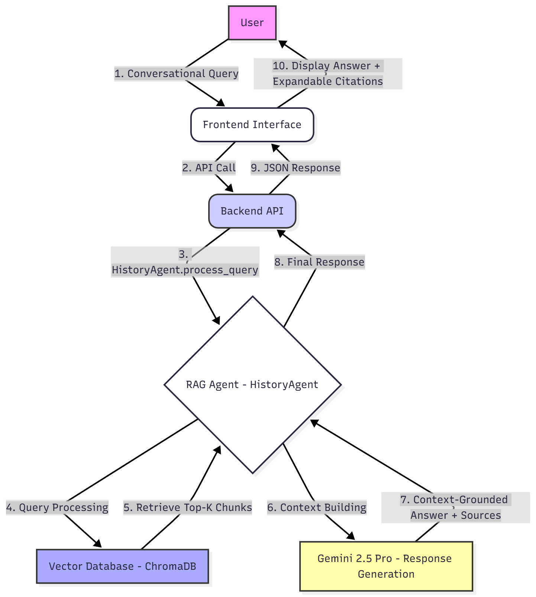
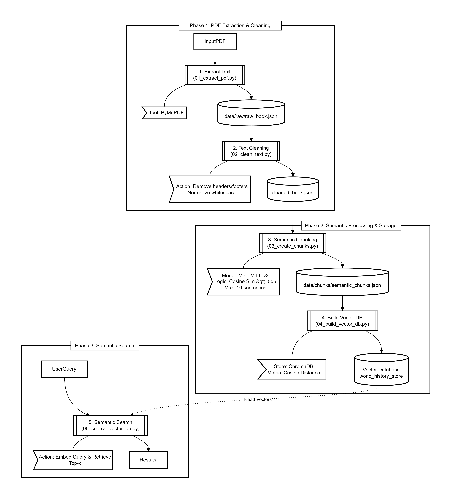

# World History Search Pipeline

A semantic search system for world history textbooks, transforming raw educational content into a queryable vector database for intelligent retrieval and AI-powered tutoring.

## Project Architecture



## Data Pipeline Overview



## Features

- **PDF Extraction**: Converts textbooks to structured text with chapter/page metadata.
- **Text Cleaning**: Removes noise, normalizes formatting, and preserves structure.
- **Semantic Chunking**: Groups sentences by meaning using transformer embeddings.
- **Vector Database**: Stores chunks in ChromaDB for fast similarity search.
- **Semantic Search**: Retrieves relevant passages with context-aware ranking.

## Technology Stack

- Python 3.10
- sentence-transformers (`all-MiniLM-L6-v2`)
- ChromaDB
- NLTK
- pymupdf
- LangChain
- Jupyter Lab
- Gemini API

## Installation

1. Clone the repository
```bash
git clone https://github.com/ChamoChiran/world-history-search-pipeline.git
```
2. Locate the directory
```bash
cd world-history-search-pipeline
```
3. Setup python environment
```bash
pip install -r requirements.txt
```
4. Install and download required nltk packages.
```bash
python -c "import nltk; nltk.download('punkt')"
```

## Usage

Run the pipeline step-by-step:

```bash
python scripts/01_extract_pdf.py      
# Extract text from PDF
```
```bash
python scripts/02_clean_text.py       
# Clean extracted text
```
```bash
python scripts/03_create_chunks.py    
# Create semantic chunks
```
```bash
python scripts/04_build_vector_db.py  
# Build vector database
```
```bash
python scripts/05_search_vector_db.py 
# Search the database
```


Explore interactively in notebooks:
- `notebooks/pdf-explore.ipynb`
- `notebooks/pdf-extract-test.ipynb`
- `notebooks/vector-search.ipynb`

## Project Structure

```
app/
  backend/      # API and core logic
  frontend/     # Web UI
data/           # Raw, cleaned, and vectorized data
diagrams/       # Architecture images
notebooks/      # Jupyter exploration
scripts/        # Pipeline scripts
src/            # Main modules (agents, embeddings, ingestion, retrieval, utils)
```

## Example Query

```python
from src.retrieval.search import search_vector_db

results = search_vector_db(
    query="How did the Neolithic Revolution change human societies?",
    k=5
)

for result in results:
    print(f"Chapter: {result['chapter']}")
    print(f"Text: {result['text']}\n")
```

## Use Cases

- AI-powered history context retrieval
- Semantic research tools

## Roadmap

- LLM integration for conversational tutoring
- Multi-document support
- Web interface (HTML, CSS/FastAPI)
- Advanced metadata filtering
- Citation/source tracking
- Multi-modal (images, charts) support

## License

MIT License. See LICENSE for details.
